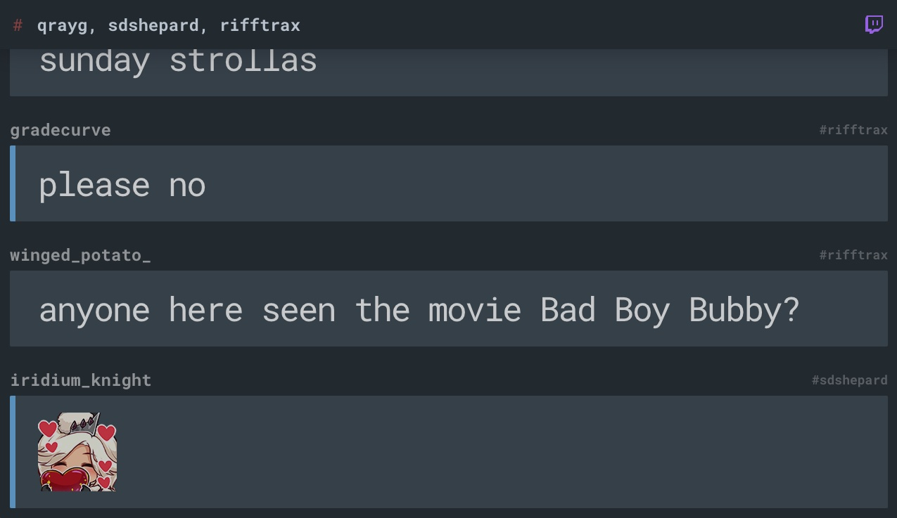

Original: https://github.com/craigerskine/twitch-chat
---

HOI!
---
Here i give u some Help ^^

Install:
---
1. Download it
2. Edit `index.html` and Search for: `token` | `username`
3. Get your Token from: [Here](https://twitchapps.com/tmi) and Change the Token ^^
4. Change the Username
5. Enjoy!

Additional:
---
You can Change the Main room too OwO
Just search "input type="text" id="channel"" and Change the value OwO so Default is: "value="qrayg, sdshepard, rifftrax"" u can Change it to "value="shroud""

This is a Fork and i just Updated the Original to work again ^^ 
